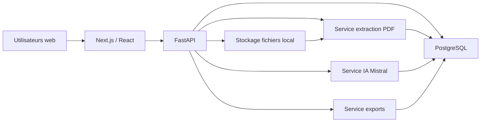

# Dossier de conception complet - FCGAA Stats

Date : 09/07/2026  
Produit : FCGAA Stats  
Langue de l'interface : français uniquement  
Stack cible : Next.js/React, FastAPI, PostgreSQL  
Déploiement cible : local PC au démarrage, architecture compatible cloud ensuite  

## 1. Périmètre confirmé

FCGAA Stats est une application SaaS privée, avec module public intégré au même site, destinée à la FCGAA et aux OGA membres. Elle doit importer, structurer, valider, consulter, comparer, analyser et publier les statistiques agricoles FCGAA.

Décisions confirmées :

- Le dossier de conception complet est le livrable actuel.
- La base de données part de zéro.
- Les PDF fournis sont la source principale au démarrage.
- Les PDF à intégrer au départ sont uniquement :
  - `Statistiques FCGAA 2026 - Exercices 2025_compressed.pdf`
  - `Statistiques FCGAA 2025 - Exercices 2024_compressed.pdf`
  - `Dico Calculs.pdf`
  - `Dico Importation.pdf`
  - `NOMENCLATURES.pdf`
- Les dictionnaires doivent être intégrés comme référentiel consultable.
- Les statistiques BIO sont dans un espace séparé des statistiques conventionnelles.
- L'import PDF doit être automatique dès le MVP, avec validation humaine assistée.
- Chaque valeur doit conserver sa source.
- Les comparaisons démarrent avec 2025 vs 2024.
- Les filtres MVP indispensables sont : clôture, récolte, profession, conventionnel/BIO, zone, quartile, indicateur.
- Le tableau de bord principal est orienté OGA connecté.
- Les zones Z1/Z2/Z3 ont une définition stable à stocker.
- L'IA est prévue dès le départ avec Mistral.
- Le ton des analyses est institutionnel.
- Les exports prioritaires sont Excel, CSV, PDF et PNG.
- Le format A4 imprimable est inclus dès le MVP.
- PowerPoint est une phase future.
- La cotisation bloque automatiquement l'accès, sauf exception du super administrateur.
- Toutes les consultations doivent être journalisées.
- Suppression/anonymisation des comptes utilisateurs à prévoir.
- Compatibilité SSO future à prévoir.
- Docker Compose doit permettre de lancer PostgreSQL, backend et frontend.

## 2. Règle absolue anti-invention

L'application ne doit jamais inventer de chiffres.

Une valeur affichée, comparée, exportée ou utilisée par l'IA doit provenir exclusivement d'une source identifiée :

- PDF statistique importé et validé ;
- donnée validée en base ;
- dictionnaire de calculs ;
- dictionnaire d'importation ;
- nomenclature FCGAA ;
- saisie/correction validée par un utilisateur autorisé.

Si une donnée est absente, incohérente, non extraite ou non validée, l'application affiche :

- `Donnée non disponible` si la valeur manque ;
- `Donnée à vérifier` si une extraction existe mais n'est pas fiable ;
- `Donnée non validée` si elle existe en brouillon mais n'a pas encore passé le workflow de validation.

L'IA ne calcule pas de valeurs non présentes en base validée, sauf si la formule existe dans le dictionnaire de calculs et que toutes les entrées nécessaires sont validées. Toute donnée calculée doit conserver :

- la formule utilisée ;
- la version de formule ;
- les valeurs sources ;
- les pages/lignes/tableaux sources lorsque la donnée vient d'un PDF ;
- l'utilisateur ou le traitement ayant déclenché le calcul ;
- la date de calcul.

## 3. Inventaire des sources inspectées

Les documents suivants ont été détectés localement dans `S:/FCGAA/Stat Nationales/Campagnes/2026/Rapports`.

| Source | Rôle | Constats techniques |
| --- | --- | --- |
| `Statistiques FCGAA 2026 - Exercices 2025_compressed.pdf` | Recueil statistique clôture/exercices 2025 | PDF numérique extractible, 73 pages détectées |
| `Statistiques FCGAA 2025 - Exercices 2024_compressed.pdf` | Recueil statistique clôture/exercices 2024 | PDF numérique extractible, 102 pages détectées |
| `Dico Calculs.pdf` | Référentiel formules | 1 page détectée, formules FCGAA SBA, codes comme `PRHT`, `MBRU`, `EBHE`, `AFIN`, `FFIN`, `FROU` |
| `Dico Importation.pdf` | Référentiel champs NBA/SBA | 7 pages détectées, champs séparés par `;`, tracés NBA et SBA |
| `NOMENCLATURES.pdf` | Référentiel professions | 6 pages détectées, 199 lignes de nomenclature indiquées dans le document |
| `LogoFCGAA-rond.jpg` | Identité visuelle | Logo fourni sur lecteur `J:` |
| Infographies PNG 2025 vs 2024 | Référence visuelle et contenus validés à reproduire | À utiliser comme modèle graphique et contrôle métier, pas comme source brute prioritaire si le PDF/base validée diverge |

Règle de priorité confirmée : en cas de contradiction, le PDF prioritaire prévaut, puis la base validée après correction humaine documentée.

## 4. Découpage temporel

Le modèle temporel doit privilégier l'année de clôture, conformément à la demande.

Dimensions temporelles à stocker :

- `annee_recueil` : année affichée/titre du recueil, par exemple 2025 ou 2026.
- `annee_cloture` : année principale d'analyse et de comparaison, par exemple exercices clos en 2024 ou 2025.
- `annee_recolte` : année de récolte lorsqu'elle est détectée dans le recueil.
- `annee_exercice` : année d'exercice si elle doit être distinguée de la clôture dans certains cas.

Règle MVP :

- Les dashboards et comparaisons utilisent d'abord `annee_cloture`.
- Les filtres permettent ensuite de préciser la récolte si la donnée existe.
- Une valeur sans clôture détectée est importée en anomalie bloquante.
- Une valeur sans récolte détectée peut rester disponible si le tableau source n'utilise pas cette dimension ; elle est alors marquée `recolte_non_applicable` ou `recolte_non_detectee` selon le cas.

## 5. Utilisateurs, rôles et droits

Rôles MVP :

| Rôle | Accès |
| --- | --- |
| Super administrateur FCGAA | Accès complet, imports, validation, formules, nomenclatures, OGA, cotisations, exceptions, publication |
| Administrateur OGA | Accès aux statistiques FCGAA selon abonnement, gestion des utilisateurs de son OGA, exports selon droits |
| Utilisateur OGA | Consultation, recherche, favoris, exports si autorisés |
| Lecteur public | Accès aux statistiques et exports publics autorisés |

Droits transverses :

- Un OGA accède à toutes les statistiques FCGAA incluses dans son abonnement.
- Les statistiques sont anonymisées et mutualisées.
- La cotisation active est obligatoire pour l'accès privé.
- Le super administrateur peut créer une exception d'accès temporaire ou permanente.
- Toutes les consultations privées sont journalisées.

Permissions à modéliser :

- `import:upload`
- `import:review`
- `import:validate`
- `statistics:read`
- `statistics:export`
- `analysis:generate`
- `publication:manage`
- `referential:manage`
- `billing:manage`
- `users:manage`
- `audit:read`

## 6. Modules fonctionnels

### 6.1 Authentification

MVP :

- email + mot de passe ;
- hash sécurisé des mots de passe ;
- sessions expirables ;
- réinitialisation de mot de passe ;
- blocage après tentatives échouées ;
- rôles et permissions ;
- préparation SSO via séparation `identity_provider` et `external_subject_id`.

Phase future :

- SSO ;
- double authentification ;
- politique mot de passe FCGAA spécifique si elle est définie plus tard.

### 6.2 Gestion OGA et cotisations

Le module gère :

- OGA ;
- code OGA ;
- coordonnées ;
- responsable ;
- utilisateurs ;
- statut de cotisation ;
- période d'abonnement ;
- suspension automatique ;
- exceptions d'accès ;
- historique des cotisations ;
- droits spécifiques.

Règle d'accès :

```text
acces_autorise = abonnement_actif OU exception_super_admin_active
```

### 6.3 Référentiels

Référentiels consultables dans l'administration :

- dictionnaire des calculs ;
- dictionnaire d'importation NBA/SBA ;
- nomenclature FCGAA ;
- zones Z1/Z2/Z3 ;
- indicateurs ;
- formules ;
- familles éditoriales de professions ;
- modèles d'infographies.

Chaque référentiel doit être versionné.

### 6.4 Import PDF

Flux MVP :

1. Téléversement PDF.
2. Empreinte du fichier.
3. Stockage du PDF source.
4. Extraction texte/tableaux.
5. Détection du type de document.
6. Détection de l'année de clôture.
7. Détection de la récolte si présente.
8. Détection conventionnel/BIO.
9. Détection profession/code nomenclature.
10. Détection zone ou quartile.
11. Extraction des indicateurs.
12. Association de chaque valeur à sa page/tableau/ligne.
13. Score de confiance.
14. Rapport d'anomalies.
15. Prévisualisation.
16. Validation humaine assistée.
17. Intégration en base validée.

Statuts d'import :

- `brouillon`
- `extraction_en_cours`
- `extrait`
- `a_verifier`
- `a_valider`
- `valide`
- `rejete`
- `archive`

Tolérance d'erreur proposée, à valider :

- Bloquant : année de clôture non détectée.
- Bloquant : type conventionnel/BIO non détecté lorsque le tableau l'exige.
- Bloquant : profession/code nomenclature non détecté.
- Bloquant : structure de tableau non reconnue.
- Bloquant : indicateur obligatoire absent pour un tableau validable.
- Non bloquant : récolte absente si le tableau n'est pas ventilé par récolte.
- Non bloquant : valeur isolée avec score faible, mais elle reste `Donnée à vérifier`.

Point à arbitrer : seuil numérique exact de rejet automatique, par exemple score moyen inférieur à 95 %, plus de 2 % de cellules non reconnues, ou tout indicateur clé absent.

### 6.5 Validation humaine assistée

L'écran de validation présente :

- PDF original à gauche ;
- tableau extrait à droite ;
- valeurs détectées ;
- indicateurs reconnus ;
- valeurs manquantes ;
- incohérences ;
- score de confiance ;
- différences avec l'année précédente si disponible ;
- synthèse d'import ;
- bouton valider/rejeter/corriger.

Chaque correction manuelle conserve :

- ancienne valeur extraite ;
- nouvelle valeur validée ;
- motif ;
- utilisateur ;
- date ;
- source PDF conservée ;
- statut.

### 6.6 Recherche

Filtres MVP :

- clôture ;
- récolte ;
- profession ;
- conventionnel/BIO ;
- zone Z1/Z2/Z3/Toutes ;
- quartile : 1/4 inférieur, médian, 1/4 supérieur ;
- indicateur.

Filtres phase 2 :

- famille éditoriale ;
- code nomenclature ;
- nombre d'OGA ;
- nombre d'exploitations ;
- régime NBA/SBA si disponible ;
- tranche de produit brut ;
- mot-clé.

### 6.7 Tableaux de bord

Tableau de bord OGA connecté :

- statut d'abonnement ;
- accès actif/suspendu/exception ;
- dernières statistiques validées ;
- recherches récentes ;
- favoris ;
- exports récents ;
- alertes principales ;
- synthèses institutionnelles disponibles.

Tableau de bord profession :

- chiffres clés ;
- évolution 2025 vs 2024 ;
- conventionnel/BIO séparés ;
- zones ;
- quartiles ;
- indicateurs par hectare si disponibles ;
- alertes population/variation ;
- analyse IA institutionnelle ;
- exports.

Tableau de bord année/clôture :

- professions disponibles ;
- nombre d'OGA ;
- nombre d'exploitations ;
- zones ;
- familles éditoriales ;
- BIO/conventionnel ;
- imports et validations.

### 6.8 Comparaisons

Comparaison MVP :

- clôture 2025 vs clôture 2024 ;
- même profession ;
- même espace : conventionnel ou BIO ;
- même zone ou même quartile ;
- mêmes indicateurs ;
- affichage de l'écart valeur et pourcentage seulement si les deux valeurs sont validées.

Règles :

- Si la population change, afficher l'évolution du nombre d'exploitations et un avertissement.
- Si une valeur manque, ne pas calculer d'écart.
- Si le dénominateur est nul ou absent, ne pas calculer de pourcentage.
- Ne pas conclure à une causalité.

### 6.9 IA Mistral

Le module IA utilise Mistral dès le départ, mais il doit être encadré.

Sources autorisées pour produire une analyse :

- valeurs validées en base ;
- formules validées ;
- nomenclatures validées ;
- métadonnées d'import ;
- recherches externes autorisées explicitement, uniquement pour contexte qualitatif et avec citation.

Règle à figer : les recherches externes ne doivent jamais remplacer les chiffres FCGAA. Elles peuvent aider à contextualiser un fait, par exemple météo, marché ou réglementation, seulement si la source est citée et si le texte indique que cela ne démontre pas une causalité.

Sorties IA :

- chiffres clés ;
- faits marquants ;
- points de vigilance ;
- synthèse courte ;
- synthèse longue ;
- analyse comparative ;
- alertes.

Garde-fous :

- prompt système anti-invention ;
- contexte limité aux données validées ;
- citation des valeurs utilisées ;
- interdiction de causalité non démontrée ;
- pas de valeur estimée ;
- mention des données absentes ;
- mention des populations faibles ;
- journalisation de la requête IA, du contexte fourni et de la réponse.

Validation :

- Les analyses IA ne nécessitent pas de validation administrateur avant publication/export, selon arbitrage utilisateur.
- Recommandation technique : conserver tout de même un statut `generee`, `publiee`, `retiree`, pour permettre retrait ou régénération.

### 6.10 Infographies

Les infographies doivent ressembler obligatoirement aux deux PNG fournis.

Formats MVP :

- PNG ;
- PDF A4 imprimable ;
- fiche comparaison 2025 vs 2024 ;
- fiche profession ;
- fiche BIO séparée ;
- synthèse OGA consultable.

Principes graphiques :

- logo FCGAA ;
- vert agricole ;
- bleu/vert institutionnel ;
- violet viticole ;
- jaune doré ;
- fond clair ;
- ton sobre, lisible, professionnel ;
- blocs chiffres clés ;
- flèches hausse/baisse/stabilité ;
- graphiques simples ;
- mention source et date de génération.

Règle anti-invention :

- une infographie ne peut être générée que depuis des données validées ;
- si une valeur manque, afficher `Donnée non disponible` ;
- si une valeur est incertaine, afficher `Donnée à vérifier` et bloquer l'export public.

### 6.11 Exports

Exports MVP :

- Excel ;
- CSV ;
- PDF ;
- PNG.

Chaque export contient :

- titre ;
- clôture ;
- récolte si applicable ;
- profession ;
- espace conventionnel/BIO ;
- zone/quartile ;
- source ;
- date de génération ;
- utilisateur générateur en privé ;
- mention `Données issues des recueils statistiques FCGAA` ;
- avertissement si données incomplètes.

### 6.12 Module public

Le module public est intégré au même site.

Règles confirmées :

- les visiteurs publics peuvent télécharger des PDF/PNG ;
- les synthèses IA publiques ne nécessitent pas de validation séparée ;
- chaque statistique publique ne doit pas être sélectionnée manuellement.

Règle de publication à définir :

- publication automatique de toutes les statistiques validées ?
- publication automatique seulement des indicateurs marqués `publics` ?
- publication automatique par profession/famille après activation globale ?

Recommandation MVP : utiliser une règle de publication par politique, pas par sélection manuelle valeur par valeur. Exemple : un super administrateur active `publication_publique = true` sur une clôture, une profession ou une famille éditoriale ; toutes les valeurs validées et autorisées deviennent publiques.

## 7. Architecture technique

Architecture logique :



Services backend :

- `auth_service`
- `oga_service`
- `subscription_service`
- `referential_service`
- `pdf_import_service`
- `validation_service`
- `statistics_service`
- `comparison_service`
- `ai_analysis_service`
- `infographic_service`
- `export_service`
- `publication_service`
- `audit_service`

Docker Compose local :

- `frontend` : Next.js ;
- `backend` : FastAPI ;
- `postgres` : PostgreSQL ;
- `redis` : files d'attente et cache, recommandé ;
- `worker` : extraction PDF, IA, exports ;
- `minio` optionnel en local si l'on veut simuler S3.

Compatibilité cloud :

- stockage fichiers compatible S3 ;
- base PostgreSQL managée possible ;
- workers séparables ;
- variables d'environnement pour Mistral ;
- reverse proxy HTTPS ;
- logs centralisables.

## 8. Modèle de données cible

Tables de sécurité :

- `users`
- `roles`
- `permissions`
- `role_permissions`
- `ogas`
- `subscriptions`
- `access_exceptions`
- `sessions`
- `password_reset_tokens`
- `audit_logs`

Tables fichiers/import :

- `source_files`
- `import_batches`
- `import_pages`
- `import_tables`
- `import_rows`
- `import_cells`
- `import_anomalies`
- `validation_events`

Tables référentielles :

- `statistical_years`
- `production_spaces` : conventionnel, BIO
- `professions`
- `profession_groups`
- `profession_group_members`
- `nomenclatures`
- `zones`
- `quartiles`
- `indicators`
- `indicator_categories`
- `formulas`
- `formula_versions`
- `import_dictionary_fields`
- `calculation_dictionary_entries`

Tables statistiques :

- `statistics_values`
- `statistics_value_sources`
- `calculated_values`
- `comparisons`
- `alerts`
- `ai_analyses`
- `ai_analysis_sources`
- `infographics`
- `exports`
- `publications`

### 8.1 Tables clés

`statistics_values`

| Champ | Description |
| --- | --- |
| `id` | Identifiant |
| `statistical_year_id` | Clôture/récolte/recueil |
| `production_space_id` | Conventionnel ou BIO |
| `profession_id` | Profession FCGAA |
| `indicator_id` | Indicateur |
| `zone_id` | Z1/Z2/Z3/Toutes, nullable |
| `quartile_id` | 1/4 inférieur, médian, 1/4 supérieur, nullable |
| `value_numeric` | Valeur numérique si disponible |
| `value_text` | Valeur textuelle si nécessaire |
| `unit` | K€, %, ha, K€/ha, nombre |
| `value_kind` | moyenne, pourcentage, montant, ratio, nombre |
| `validation_status` | brouillon, à vérifier, validé, rejeté |
| `confidence_score` | Score extraction |
| `source_file_id` | PDF source |
| `source_page` | Page source |
| `source_table_id` | Tableau source |
| `source_row_label` | Libellé ligne source |
| `source_column_label` | Libellé colonne source |
| `created_at` | Date création |
| `validated_at` | Date validation |
| `validated_by` | Validateur |

`statistical_years`

| Champ | Description |
| --- | --- |
| `id` | Identifiant |
| `annee_recueil` | Année du recueil |
| `annee_cloture` | Année principale |
| `annee_recolte` | Année récolte si applicable |
| `annee_exercice` | Année exercice si distincte |
| `label` | Libellé affiché |
| `is_active` | Actif |

`ai_analyses`

| Champ | Description |
| --- | --- |
| `id` | Identifiant |
| `profession_id` | Profession |
| `statistical_year_id` | Clôture |
| `production_space_id` | Conventionnel/BIO |
| `analysis_type` | courte, longue, comparative |
| `prompt_version` | Version prompt |
| `model_provider` | Mistral |
| `model_name` | Nom modèle configuré |
| `content` | Texte généré |
| `status` | générée, publiée, retirée |
| `generated_by` | Utilisateur ou tâche |
| `generated_at` | Date |

## 9. API cible

Endpoints principaux :

- `POST /auth/login`
- `POST /auth/logout`
- `POST /auth/password-reset`
- `GET /me`
- `GET /ogas`
- `POST /ogas`
- `GET /subscriptions`
- `POST /imports/pdf`
- `GET /imports/{id}`
- `POST /imports/{id}/extract`
- `POST /imports/{id}/validate`
- `POST /imports/{id}/reject`
- `GET /referentials/nomenclatures`
- `GET /referentials/calculations`
- `GET /referentials/import-fields`
- `GET /professions`
- `GET /statistics`
- `GET /statistics/{id}/sources`
- `GET /comparisons`
- `POST /ai/analyses`
- `GET /ai/analyses`
- `POST /infographics`
- `POST /exports`
- `GET /public/statistics`
- `GET /audit/logs`

## 10. Écrans principaux

MVP privé :

- connexion ;
- réinitialisation mot de passe ;
- tableau de bord OGA ;
- recherche statistiques ;
- fiche profession ;
- comparaison 2025 vs 2024 ;
- espace BIO ;
- espace conventionnel ;
- détail source d'une valeur ;
- export ;
- liste des infographies ;
- administration OGA ;
- administration utilisateurs ;
- administration cotisations ;
- import PDF ;
- validation d'import ;
- référentiels ;
- logs de consultation.

MVP public :

- accueil public FCGAA Stats ;
- statistiques publiques ;
- infographies publiques ;
- téléchargement PDF/PNG public autorisé.

## 11. Alertes automatiques

Alertes MVP :

- population faible ;
- variation forte d'un indicateur ;
- baisse forte du nombre d'exploitations ;
- donnée manquante ;
- donnée à vérifier ;
- comparaison impossible ;
- changement d'échantillon ;
- formule incomplète.

Seuils à valider :

- population faible : nombre d'exploitations inférieur à un seuil FCGAA ;
- variation forte : pourcentage à définir par indicateur ;
- baisse forte d'échantillon : seuil à définir.

Recommandation : stocker les seuils en base par indicateur et par famille, avec une valeur par défaut globale.

## 12. Sécurité, RGPD et audit

Sécurité MVP :

- hash mot de passe ;
- expiration session ;
- protection CSRF pour cookies ;
- validation stricte des entrées ;
- requêtes SQL paramétrées via ORM ;
- contrôle d'accès côté API ;
- journalisation des connexions ;
- journalisation des consultations ;
- journalisation des imports ;
- journalisation des exports ;
- journalisation des analyses IA.

Données personnelles à stocker :

- nom ;
- prénom ;
- email ;
- rôle ;
- OGA rattaché ;
- traces de connexion ;
- traces de consultation ;
- traces d'action.

RGPD :

- responsable : FCGAA ;
- droits d'accès/export utilisateur ;
- suppression ou anonymisation ;
- limitation de conservation des logs à définir ;
- registre des traitements à produire côté FCGAA ;
- séparation entre statistiques anonymisées et données utilisateurs.

## 13. Stratégie MVP prudente

Le MVP doit être ambitieux sur l'import automatique mais prudent sur la mise à disposition des chiffres.

Priorité 1 :

- socle Docker ;
- auth ;
- rôles ;
- OGA/cotisations ;
- stockage PDF ;
- extraction PDF ;
- validation humaine ;
- base statistique ;
- sources par valeur ;
- recherche ;
- comparaison 2025 vs 2024 ;
- exports Excel/CSV/PDF/PNG ;
- infographie A4 ;
- IA Mistral encadrée ;
- audit.

Priorité 2 :

- extraction plus robuste multi-templates ;
- règles d'anomalies avancées ;
- dashboards enrichis ;
- publication publique par politique ;
- gestion fine des modèles d'infographies.

Priorité 3 :

- PowerPoint ;
- SSO ;
- chatbot statistique ;
- API externe ;
- cloud complet ;
- génération automatique du recueil annuel.

## 14. Questions restantes à trancher

Ces points ne sont pas inventés et doivent être validés avant codage détaillé.

1. Quel seuil exact bloque un import : score de confiance, nombre de cellules manquantes, ou absence d'indicateurs clés ?
2. Quelle règle automatique rend une statistique publique sans sélection manuelle ?
3. Quelles sources externes l'IA Mistral a-t-elle le droit d'utiliser pour les recherches contextuelles ?
4. Les recherches externes doivent-elles être activées dès le MVP ou seulement prévues dans l'architecture ?
5. Quel seuil définit une population faible ?
6. Quel seuil définit une variation forte ?
7. Quelle durée de conservation pour les logs de consultation ?
8. Les infographies PNG fournies doivent-elles être reproduites à l'identique pixel près ou seulement dans le même style institutionnel ?
9. Le logo doit-il être copié dans le dépôt applicatif ou référencé depuis un espace partagé FCGAA ?
10. Faut-il prévoir un compte super administrateur initial créé par script ou manuellement au premier lancement ?
11. Quel nom de domaine ou sous-domaine prévoir pour la future version cloud ?
12. L'espace BIO séparé doit-il avoir ses propres dashboards complets ou seulement des vues filtrées dédiées ?

## 15. Décision de conception finale

FCGAA Stats doit être conçu comme une application de données vérifiables, pas comme un simple outil de visualisation.

Le coeur du produit est donc :

- la traçabilité ;
- la validation ;
- la séparation conventionnel/BIO ;
- la comparaison par clôture ;
- l'exploitation institutionnelle des résultats ;
- l'export et la publication ;
- l'IA encadrée par les données validées.

Tout développement futur doit préserver cette règle : une donnée sans source n'est pas une donnée affichable.

